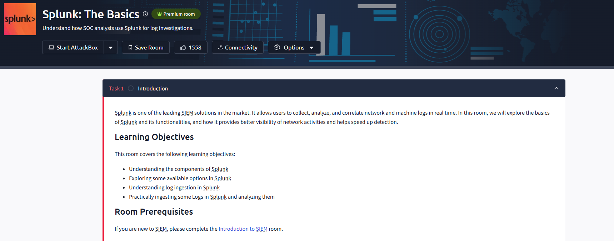
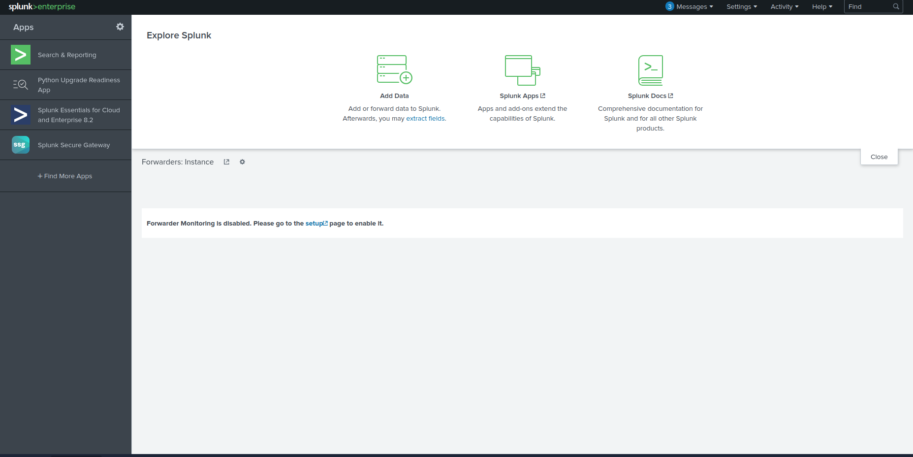
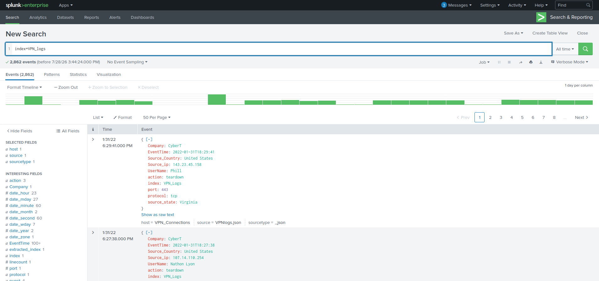
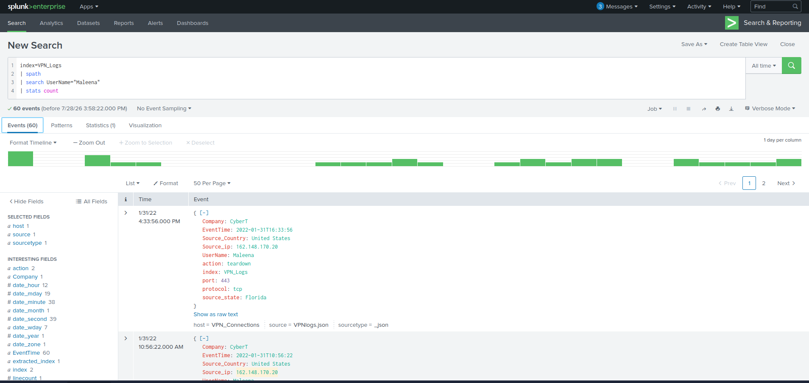
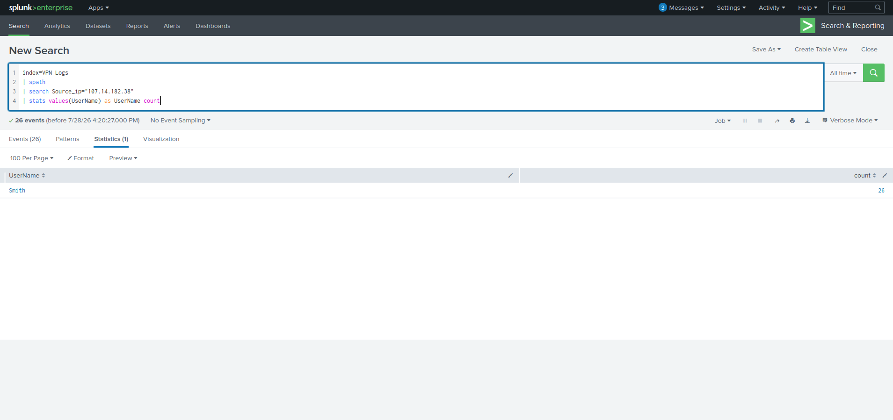
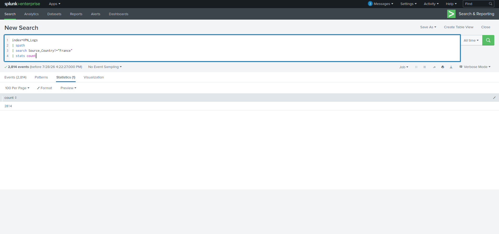

# Splunk: The Basics

## Project Overview

This project documents my completion of the TryHackMe **Splunk: The Basics** room. The goal of this lab was to develop foundational skills using Splunk Enterprise, a Security Information and Event Management (SIEM) platform used by security teams to collect, search, and analyze log data.

During this lab, I practiced querying VPN log data using Splunk Search Processing Language (SPL), filtering events, extracting fields, and analyzing security-related information from indexed data.

---

## Lab Information

| Category | Details |
|----------|---------|
| Platform | TryHackMe |
| Difficulty | Easy |
| Tool | Splunk Enterprise |
| Category | SIEM Fundamentals |
| Data Source | VPN Logs |

---

## Objectives

- Understand the basics of the Splunk interface
- Learn how indexed data can be searched and analyzed
- Practice writing basic SPL queries
- Filter events using fields and conditions
- Use SPL commands to summarize log data

---

## Skills Practiced

- Splunk navigation
- SPL querying
- Log analysis fundamentals
- Event filtering
- Field extraction using `spath`
- Data aggregation using `stats`
- Basic security investigation workflow

---

## Room Walkthrough

### Room Overview



This room introduces Splunk Enterprise and provides a beginner-friendly introduction to using a Security Information and Event Management (SIEM) platform. The exercises focus on navigating the interface and performing basic searches using Search Processing Language (SPL).

--- 

## Splunk Interface



I accessed the Splunk environment and explored the main interface, including the search functionality used to query and analyze indexed data.

--- 

## Searching VPN Logs



To begin exploring the dataset, I queried the `VPN_logs` index using the following SPL search:

```spl
index=VPN_logs
```

This search returned **2,862 events**, confirming that the VPN log data had been successfully indexed and was available for analysis. This exercise introduced the process of retrieving events from a specific index before performing more targeted searches.

---

## Filtering Events by Username



I refined my search by parsing the VPN log data with `spath`, filtering events for the user **Maleena**, and using the `stats count` command to determine how many matching events were present.

**SPL Query**

```spl
index=VPN_logs
| spath
| search UserName="Maleena"
| stats count
```

This exercise demonstrated how SPL can be used to filter log data and summarize results, which is a common technique when investigating user activity within security logs.

---

## Investigating Activity by Source IP



To investigate activity originating from a specific IP address, I searched the VPN logs for the source IP `107.14.182.38` and summarized the results.

**SPL Query**

```spl
index=VPN_logs
| spath
| search source_ip="107.14.182.38"
| stats values(UserName) as UserName count
```

This query filtered events generated by a specific source IP address, identified the associated username, and counted the total number of matching events. This demonstrates how SPL can be used to correlate network activity with user accounts during an investigation.

---

## Filtering Events by Country



To narrow the dataset, I filtered VPN log events to exclude connections originating from France.

**SPL Query**

```spl
index=VPN_logs
| spath
| search Source_Country!="France"
| stats count
```

This query demonstrates how SPL can exclude specific values from a dataset using the `!=` operator, allowing analysts to focus on activity from other geographic locations.

---

### Splunk Home Dashboard

**Screenshot:** `02-home-dashboard.png`

After launching Splunk Enterprise, I explored the main dashboard to become familiar with the interface and available applications.

---

### Search & Reporting

**Screenshot:** `03-search-reporting.png`

The Search & Reporting application is the primary workspace for analysts. It allows users to search indexed events, filter data, and investigate system activity using SPL.

---

### Executing a Search

**Screenshot:** `04-first-search.png`

I executed my first search using SPL. Splunk returned matching events from indexed log data, demonstrating how searches are used to retrieve information for analysis.

---

### Reviewing Search Results

**Screenshot:** `05-search-results.png`

The search results display event data together with metadata such as timestamps and extracted fields. This information helps analysts understand the context of each event.

---

### Lab Completion

**Screenshot:** `06-room-complete.png`

Successfully completed all tasks in the Splunk: The Basics room. This lab established a foundation for using Splunk Enterprise and understanding the role of SIEM platforms in cybersecurity operations.

---

## Skills Demonstrated

- Splunk Enterprise
- SIEM Fundamentals
- Search Processing Language (SPL)
- Log Exploration
- Event Searching
- Security Operations Basics

---

## Lessons Learned

Although this was an introductory lab, it provided a solid understanding of the Splunk interface and basic search workflow. Learning how to navigate Splunk and retrieve log data is an essential first step before performing more advanced investigations, threat hunting, and incident response.
