## Project Overview

This project documents my hands-on experience using Splunk Search Processing Language (SPL) to investigate and analyze security event data.

During this lab, I used SPL queries to search Windows and VPN logs, investigate process activity, filter and organize event data, enrich logs with additional information, assign risk scores to executable files, and identify unusual authentication behavior.

## Lab Source

- **Platform:** [TryHackMe](https://tryhackme.com)
- **Room Link:** [Splunk: Exploring SPL](https://tryhackme.com/room/splunkexploringspl)

---

## Skills Demonstrated

- Splunk Search Processing Language (SPL)
- Windows Event Log Analysis
- VPN Authentication Log Analysis
- Log Filtering and Transformation
- Process Investigation
- Regular Expressions (Regex)
- Data Enrichment
- Lookup Tables
- IP Geolocation
- Statistical Analysis
- Behavioral Anomaly Detection
- SIEM Investigation Fundamentals

---

## Tools Used

- Splunk Enterprise
- Search Processing Language (SPL)
- Windows Event Logs
- VPN Authentication Logs

---

# SPL Queries Practiced

## TryHackMe Room Overview

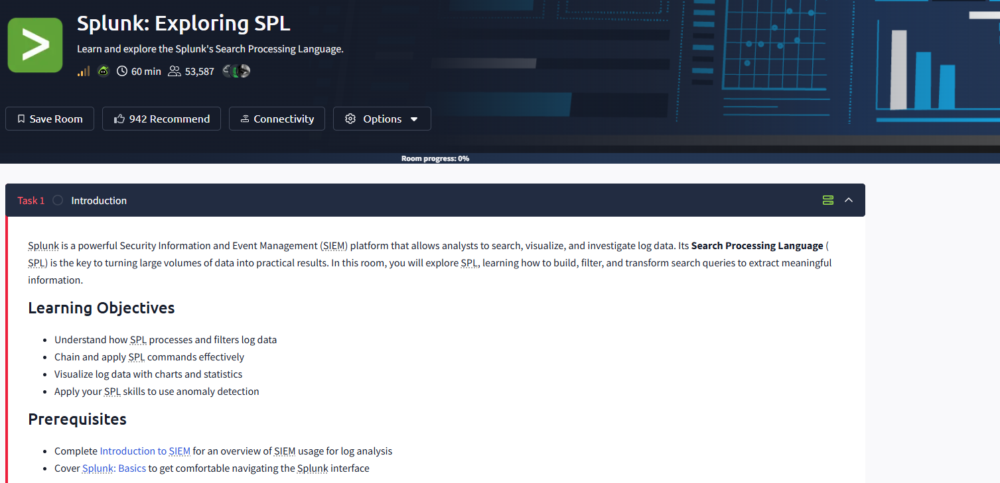

This screenshot shows the TryHackMe room used for this project, where I practiced using Splunk Search Processing Language (SPL) to analyze security event data.

---

## Splunk Interface

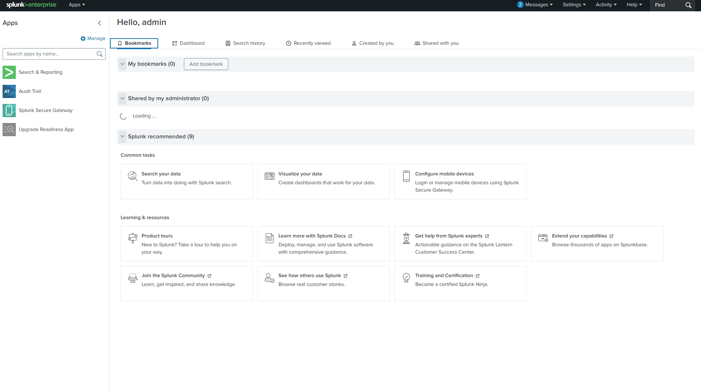

This screenshot shows the Splunk interface used throughout the lab to search, filter, and analyze Windows and VPN log data.

---


## Searching Events Within a Specific Time Range

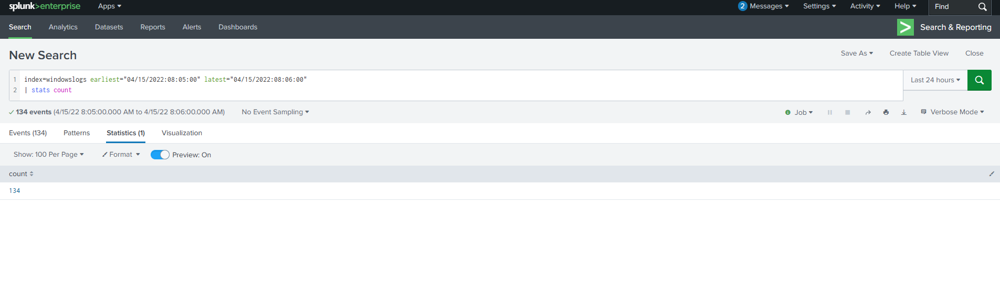

```spl
index=windowslogs earliest="04/15/2022:08:05:00" latest="04/15/2022:08:06:00"
| stats count
```

### Purpose:
I used this query to narrow Windows log data down to a specific timeframe and count the number of events generated during that period.

### What I Learned:
Time-based searches are important when investigating security events because they allow me to focus on activity that occurred around a specific incident, alert, or point of interest.

---

# Filtering Fields From Events

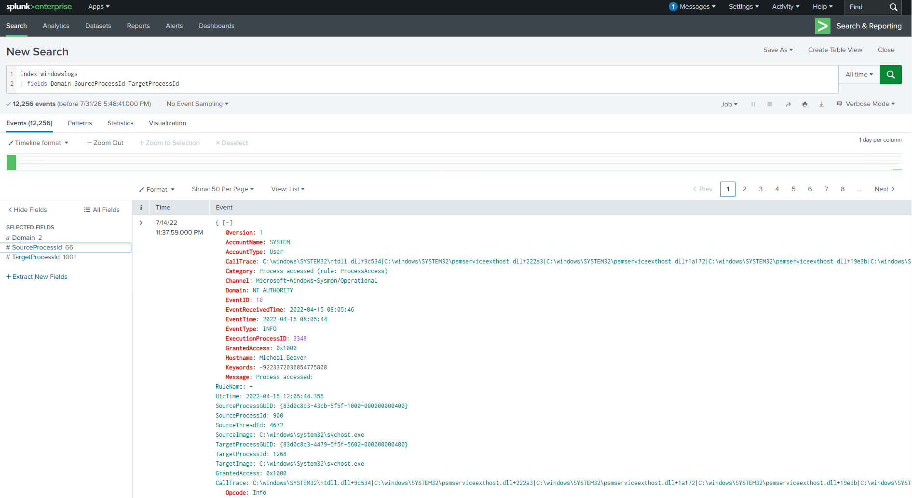

```spl
index=windowslogs
| fields Domain SourceProcessId TargetProcessId
```

### Purpose:
I used the `fields` command to display only the information needed for my investigation. This allowed me to focus on domain information and process identifiers instead of viewing unnecessary fields.

### What I Learned:
Selecting relevant fields makes large amounts of log data easier to analyze and helps reduce unnecessary information during an investigation.

---

# Creating Tables From Events

## Account Information Table

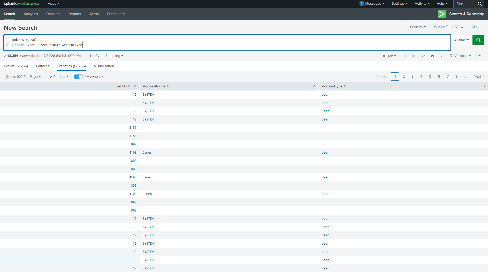

```spl
index=windowslogs
| table EventID AccountName AccountType
```

### Purpose:
I used the `table` command to organize selected fields into a readable format containing event IDs and account information.

### What I Learned:
Formatting results into tables makes it easier to review important event details and quickly identify the information I need from log data.

---

## Process Timeline Investigation

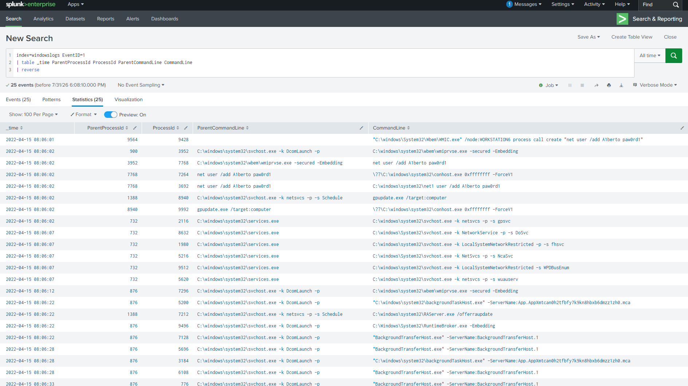

```spl
index=windowslogs EventID=1
| table _time ParentProcessId ProcessId ParentCommandLine CommandLine
| reverse
```

### Purpose:
I used this query to review Windows process creation events and display information about parent processes, child processes, and command-line activity in chronological order.

### What I Learned:
Analyzing process relationships helps me understand how programs were launched and provides additional details when reviewing suspicious execution activity.

---

# Finding Common Values Using the `top` Command

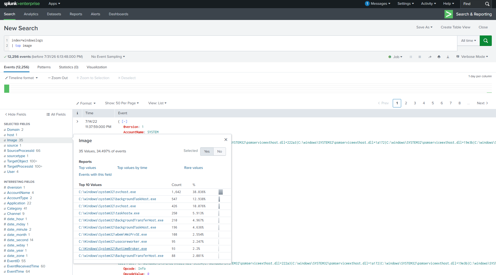

```spl
index=windowslogs
| top Image
```

### Purpose:
I used the `top` command to identify the most frequently occurring values in the `Image` field.

### What I Learned:
This helped me understand which executable files appeared most often within the dataset and provided a better understanding of common activity in the environment.

---

# Removing Duplicate Values Using `dedup` 

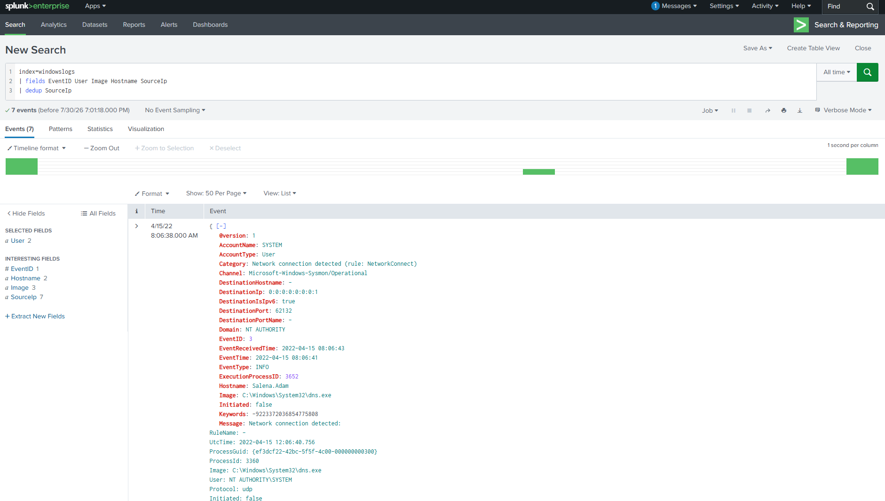

```spl
index=windowslogs
| dedup Image
```

### Purpose:
I used the `dedup` command to remove repeated values from the search results based on the `Image` field.

### What I Learned:
Removing duplicate results helps simplify the output and allows me to focus on unique executable entries instead of repeated information.

---

# Renaming Fields

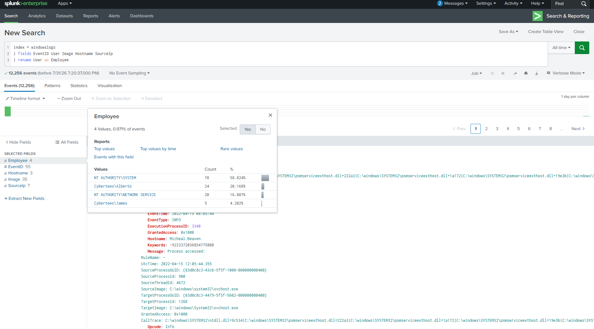

```spl
index=windowslogs
| fields EventID User Image Hostname SourceIp
| rename User as Employee
```

### Purpose:
I used the `fields` command to select specific information I wanted to review and then renamed the `User` field to `Employee` to make the output easier to understand.

### What I Learned:
Renaming fields can make search results clearer and easier to interpret when reviewing or documenting investigation findings.

---

# Filtering Data Using Regular Expressions

## Filtering Executable Files

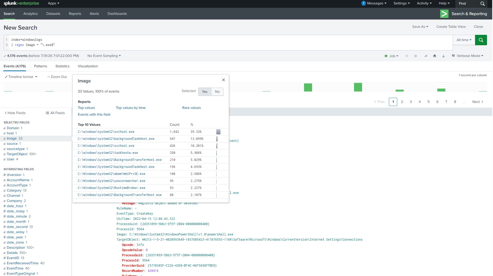

```spl
index=windowslogs
| regex Image="\.exe$"
```

### Purpose:
I used the `regex` command to filter Windows log events where the `Image` field ends with `.exe`. The expression `\.exe$` matches values that end with the executable file extension.

### What I Learned:
Regex allows me to search for specific patterns within log fields. In this case, I used regex to narrow down events involving executable files.

---

## Filtering Registry Activity

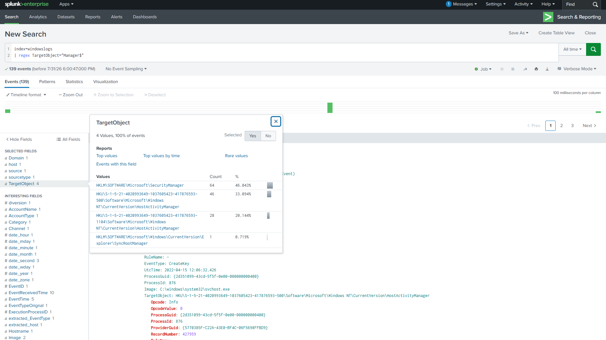

```spl
index=windowslogs
| regex TargetObject="Manager$"
```

### Purpose:
I used the `regex` command to filter events where the `TargetObject` field ended with the value "Manager".

### What I Learned:
This helped me understand how regex can be used in Splunk to search for patterns within event fields instead of relying only on exact matches.

---

# Enriching IP Addresses With Geographic Information

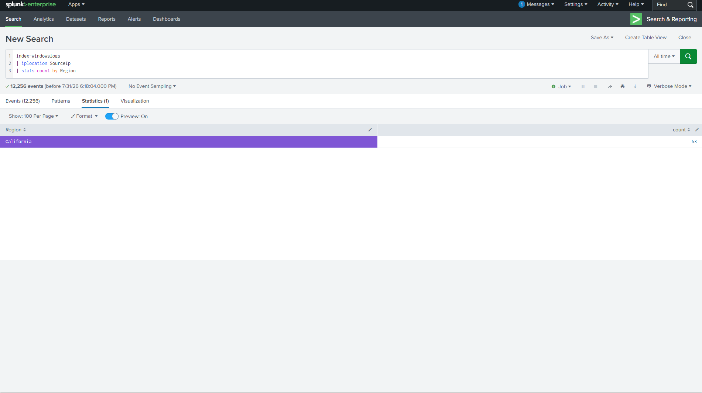

```spl
index=windowslogs
| iplocation SourceIp
| stats count by Region
```

### Purpose:
I used the `iplocation` command to add geographic information to source IP addresses and summarize the results by region.

### What I Learned:
Adding location information to IP addresses provides additional details that can help when reviewing network activity and identifying unusual access patterns.

---

# Assigning Risk Scores Using Lookup Data


```spl
index=windowslogs
| lookup image_risk score Image OUTPUT Riskscore
| search Riskscore=3
| stats count by Image Riskscore
| sort -Riskscore
```

### Purpose:
I used the `lookup` command to compare executable names found in Windows logs against a risk scoring dataset. When an executable matched an entry in the lookup data, Splunk added the corresponding risk score to the event. I then filtered the results to show events with a risk score of 3.

### What I Learned:
This exercise showed me how Splunk can combine log data with additional information to provide more context during an investigation. Instead of only seeing which executable ran, I was able to associate it with a risk score and identify higher-risk activity.

---

# Detecting VPN Country Anomalies


```spl
index=vpnlogs
| eventstats count as logins_by_user by user
| eventstats count as logins_by_user_country by src_country
| eval country_freq=logins_by_user_country/logins_by_user
| where country_freq < 0.1
| table _time user src_ip src_country country_freq
```

### Purpose:
I used this query to compare user login activity across different countries and identify locations that were uncommon for a user's normal behavior.

### What I Learned:
This helped me understand how authentication data can be analyzed for unusual geographic patterns that may require additional investigation.

---

# Detecting VPN Login Time Anomalies


```spl
index=vpnlogs
| eval hour=tonumber(strftime(_time,"%H")) + tonumber(strftime(_time,"%M"))/60
| eventstats avg(hour) as typical_hour stdev(hour) as stdev_hour by user
| eval zscore=abs(hour - typical_hour) / stdev_hour
| where zscore > 3
| eval hour=round(hour,2), typical_hour=round(typical_hour,2)
| eval stdev_hour=round(stdev_hour,2), zscore=round(zscore,2)
| table _time user src_ip src_country hour typical_hour stdev_hour zscore
| sort - hour_zscore
```

### Purpose:
I used this query to analyze VPN login times and compare each user's login activity against their typical behavior. The query calculates a z-score by comparing each login time against the user's average login time and standard deviation. I then filtered for events where the z-score was greater than 3 and sorted the results to review the most unusual login activity.

### What I Learned:

This exercise helped me understand how statistical analysis can be applied to authentication logs. By measuring how far a login time deviates from a user's normal pattern, I was able to identify authentication events that were significantly different from expected behavior and may require further investigation.
---

# Key Takeaways & Portfolio Growth

- **Noise Reduction:** Completing this TryHackMe lab helped me understand the importance of filtering and organizing large amounts of log data. Using commands like `fields` and `dedup` allowed me to reduce unnecessary information and focus on the events most relevant to an investigation.

- **Data Enrichment:**  I learned that raw log data sometimes does not really provide enough context by itself. Using commands like `iplocation` allowed me to add geographic information to source IP addresses, while lookup data allowed me to associate executable names with risk scores. These techniques helped me understand how additional context can make security events easier to analyze.

- **Statistical Baselining:** Working through the VPN login time anomaly detection query introduced me to behavioral analysis techniques used in security monitoring. By analyzing how the query calculated deviations from typical login behavior using a z-score, I learned how statistical methods can help identify unusual authentication activity.


This project strengthened my understanding of how SIEM tools can be used to analyze security events and investigate potential threats.
